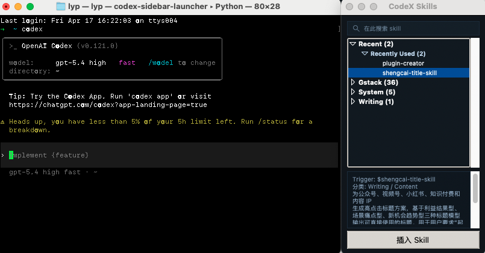

# codex-skill-sidebar

Floating skill sidebar for the OpenAI Codex terminal app on macOS.

It wraps the `codex` CLI with a small Python/Tk sidecar that:

- scans `~/.codex/skills` dynamically
- groups skills into collapsible categories
- keeps a live `Recent` section
- filters skills with search
- inserts `$skill ` into the active Codex session without using accessibility key injection
- follows the Terminal window and docks to its right edge

This project is built for Apple Terminal on macOS. The sidebar is a floating utility window, not a true split pane.

## Highlights

- Searchable skill picker that stays next to the current Codex terminal window
- Grouped skill tree with immediate `Recent` updates
- Socket-based trigger injection instead of brittle GUI keystroke automation
- Works with both `codex` and `CodeX` shell entrypoints
- Tuned for macOS Terminal with proxy-friendly SSH publishing workflow

## Quick start

```bash
mkdir -p ~/.local/bin
cp bin/codex-sidebar-launcher ~/.local/bin/
cp bin/codex-skill-sidebar.py ~/.local/bin/
chmod +x ~/.local/bin/codex-sidebar-launcher ~/.local/bin/codex-skill-sidebar.py
cat config/zshrc.snippet >> ~/.zshrc
source ~/.zshrc
codex
```

## Screenshots

Codex with the docked sidebar




## What is included

- `bin/codex-sidebar-launcher`
  Wrapper that launches Codex inside a PTY and opens the sidebar.
- `bin/codex-skill-sidebar.py`
  The sidebar UI and skill loader.
- `config/zshrc.snippet`
  Shell functions that route both `codex` and `CodeX` through the launcher.
- `config/config.toml.snippet`
  Optional Codex config snippet to disable the built-in `apps` feature if it causes MCP startup warnings.

## Requirements

- macOS
- Python 3 with Tkinter
- OpenAI Codex CLI installed at `/usr/local/bin/codex`
- Skills installed under `~/.codex/skills`

Optional:

- `pyobjc` for better multi-display screen edge detection

## Install

1. Copy the scripts into your local bin directory:

   ```bash
   mkdir -p ~/.local/bin
   cp bin/codex-sidebar-launcher ~/.local/bin/
   cp bin/codex-skill-sidebar.py ~/.local/bin/
   chmod +x ~/.local/bin/codex-sidebar-launcher ~/.local/bin/codex-skill-sidebar.py
   ```

2. Add the shell wrapper from `config/zshrc.snippet` into `~/.zshrc`.

3. If needed, merge the snippet from `config/config.toml.snippet` into `~/.codex/config.toml`.

4. Reload your shell:

   ```bash
   source ~/.zshrc
   ```

5. Start Codex:

   ```bash
   codex
   ```

## Usage

- Launch with `codex` or `CodeX`
- Click a skill to inspect its description
- Double click a skill to insert `$skill `
- Press `Return` in the terminal to send it normally
- Press `Cmd-R` or `F5` inside the sidebar to refresh installed skills

## Repository layout

- `bin/`
  Runtime scripts
- `config/`
  Shell and Codex config snippets
- `CHANGELOG.md`
  Version history for public releases

## How it works

- The launcher starts the real Codex binary in a PTY.
- A Unix datagram socket is created for the session.
- The sidebar sends trigger text like `$browse ` to the launcher over that socket.
- The launcher writes that text directly into the Codex PTY.

This avoids GUI key injection and is much more stable on macOS.

## Skill loading

The sidebar rescans `~/.codex/skills` and looks for `SKILL.md` files.

It reads:

- frontmatter `name` as the trigger
- frontmatter `description` or the first body paragraph as the summary

Newly installed skills show up on next launch, or immediately after refresh with `Cmd-R` / `F5`.

## UI behavior

- Single click selects a skill and shows its description
- Double click inserts the trigger without sending
- Press `Return` in Terminal to submit normally
- `Recent` updates immediately after a skill is inserted

## Development notes

- The launcher expects the real Codex binary at `/usr/local/bin/codex`
- The sidebar reads skills from `~/.codex/skills`
- GitHub publishing in proxy-heavy environments works reliably over SSH on `ssh.github.com:443`

## Limitations

- macOS only
- tuned for Apple Terminal
- the sidebar is attached visually to the terminal edge, but it is still a separate floating window

## Roadmap

- Add optional screenshot assets to the repo landing page
- Improve non-Terminal.app support
- Add a more formal installer script

## License

MIT
